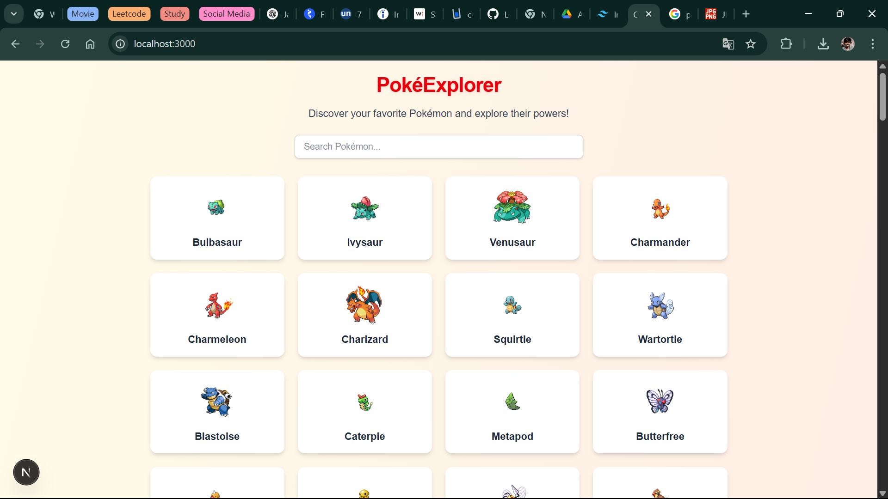
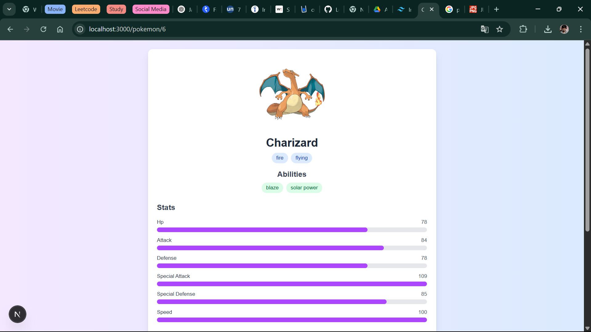
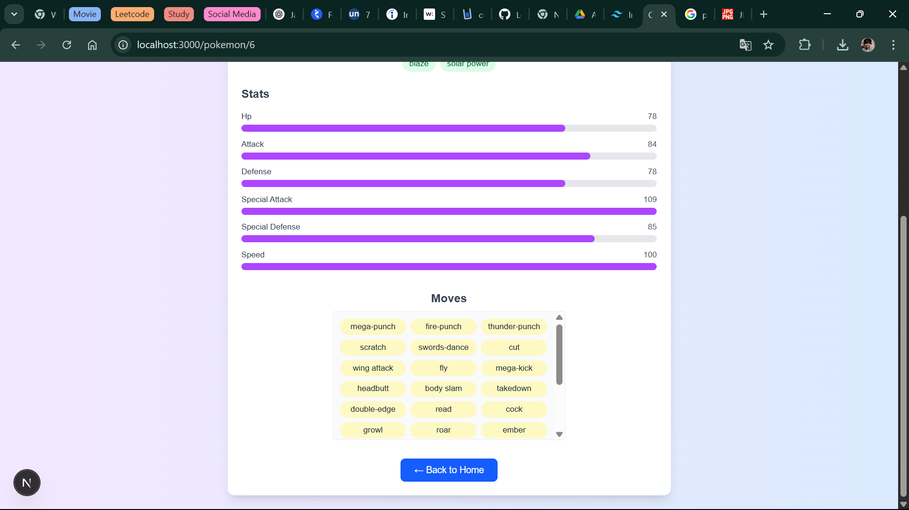

# 🧭 Pokémon Explorer

Welcome to **Pokémon Explorer** – a sleek, responsive web app built with **Next.js** and styled using **Tailwind CSS**. This project allows users to browse, search, and view detailed information about their favorite Pokémons using data from the **PokeAPI**.

---

## 🚀 Features

- 🔍 **Search & Explore:** Browse through a list of Pokémons and filter by name using a live search bar.
- 📄 **Detailed View:** Click any Pokémon card to view its image, abilities, types, base stats, and moves.
- 🌐 **Dynamic Routing:** Uses Next.js dynamic routes (`/pokemon/[id]`) to navigate to each Pokémon’s page.
- ⚡ **Performance Optimized:** Built with **Static Site Generation (SSG)** for lightning-fast performance.
- 💅 **Responsive UI:** Clean and modern UI that adapts beautifully to desktop and mobile devices.

---

## 🛠️ Tech Stack

- **Framework:** Next.js (App Router)
- **Styling:** Tailwind CSS
- **API:** [PokeAPI](https://pokeapi.co)
- **Hosting:** GitHub Pages

---

## 📁 Project Structure

├── public/
│   └── Screenshot_1.png         // Screenshot for README
│   └── Screenshot_2.png         // Screenshot for README
│   └── Screenshot_3.png         // Screenshot for README
│   └── pokemon.png              // App icon
src/
├── app/
│   ├── page.jsx               // Homepage with search + Pokémon list
│   └── pokemon/
│       └── [id]/page.jsx      // Pokémon detail page
├── Components/
│   └── PokemonCard.jsx        // Reusable card component

---

## 📸 Screenshot





---

## 🧑‍💻 Getting Started

### 📦 Clone & Install

```bash
git clone https://github.com/YourUsername/pokemon-explorer.git
cd pokemon-explorer
npm install
npm run dev
```

## 🔗 Live Demo


---

## 👨‍🎓 Author
Made with 💙 by Aryan Shubbu


